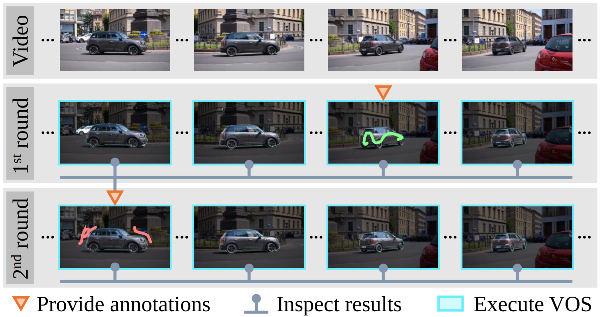

# Guided Interactive Video Object Segmentation Using Reliability-Based Attention Maps
### Yuk Heo, Yeong Jun Koh, Chang-Su Kim

Implementation of CVPR2021 oral paper (best paper candidate), "Guided Interactive Video Object Segmentation Using Reliability-Based Attention Maps"



[[Paper]](http://mcl.korea.ac.kr/~yyuk25/CVPR2021/2021_CVPR_YHEO.pdf)
[[Project page]](http://mcl.korea.ac.kr/yukheo_cvpr2021/)
[[Video-introduction]](https://www.youtube.com/watch?v=J_Gc0N3aXXo)
[[Video-comparison]](https://www.youtube.com/watch?v=-kcqDb96Y0Q)

Codes in this github:

1. DAVIS2017 evaluation based on the [DAVIS framework](https://interactive.davischallenge.org/)
2. Youtube-iVOS evaluation based on the [Youtube2019](https://youtube-vos.org/dataset/)
3. DAVIS2017 real-world evaluation GUI - linked to [GUI-iVOS_and_GIS](https://github.com/yuk6heo/GUI-iVOS_and_GIS)

## Prerequisite
- cuda 11.0
- python 3.6
- pytorch 1.6.0
- [davisinteractive 1.0.4](https://github.com/albertomontesg/davis-interactive)
- numpy, cv2, PtQt5, and other general libraries of python3

## Directory Structure
 * `root/checkpoints`: save our checkpoints (pth extensions) here.
 
 * `root/dataset_torch`: pytorch datasets.
 
 * `root/libs`: library of utility files.

 * `root/networks` : codes for networks
     - `deeplab`: applies ASPP module in decoders. [[original code]](https://github.com/jfzhang95/pytorch-deeplab-xception/tree/master/modeling)
     - `network.py`: consists our whole network.
 
 * `root/results` : result files for both evaluation results are attached.

 * `root/config.py`  : configurations. you must set your directories here.
 
 * `root/IVOS_main_DAVIS.py` : DAVIS2017 evaluation based on the [DAVIS framework](https://interactive.davischallenge.org/).
  
 * `root/IVOS_main_youtube.py` : Youtube-iVOS evaluation based on the [Youtube2019](https://youtube-vos.org/dataset/).

## Instruction

### DAVIS2017 evaluation based on the DAVIS framework

1. Edit `config.py` to set the directory of your DAVIS2017 dataset and the other configurations.
2. Download our parameters and place the file as `root/checkpoints/GIS-ckpt_standard.pth`.
    - For DAVIS2017 evaluation [[Google-Drive]](https://drive.google.com/file/d/1dkgXJJ2gPYDtPE9yTtlP4Th0iNX5ZG6a/view?usp=sharing)
    - For youtube2019 evaluation [[Google-Drive]](https://drive.google.com/file/d/1m52fHwoYt2zupSmqgvDYUTqB24ApX0my/view?usp=sharing)
 
3. Evaluate with
    - `python3 IVOS_main_DAVIS.py`.
    - `python3 IVOS_main_youtube.py`.

### DAVIS2017 real-world evaluation GUI

Multi-object GUI (for DAVIS2017) is available at our github page, [GUI-iVOS_and_GIS](https://github.com/yuk6heo/GUI-iVOS_and_GIS)

## Reference

Please cite our paper if the implementations are useful in your work:
```
@Inproceedings{
Yuk2021GIS,
title={Guided Interactive Video Object Segmentation Using Reliability-Based Attention Maps},
author={Yuk Heo and Yeong Jun Koh and Chang-Su Kim},
booktitle={CVPR},
year={2021},
url={https://openaccess.thecvf.com/content/CVPR2021/papers/Heo_Guided_Interactive_Video_Object_Segmentation_Using_Reliability-Based_Attention_Maps_CVPR_2021_paper.pdf}
}
```
